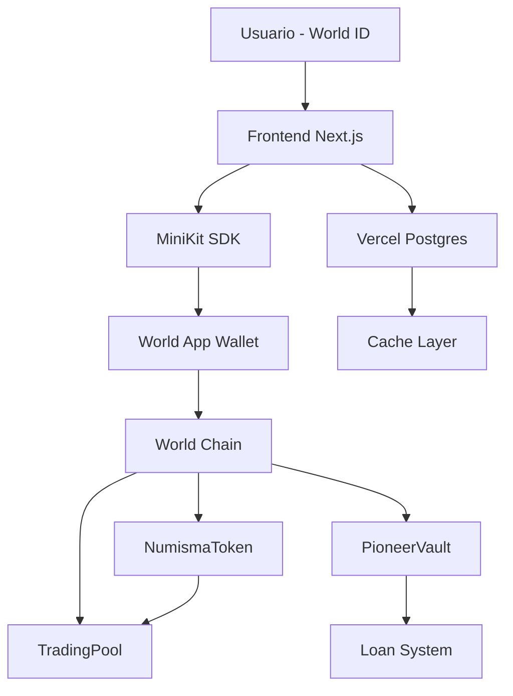

# 🏛️ Numisma - Educational Trading Platform on World Chain

**Plataforma educativa de trading verificada con World ID, token NUMA y Smart Contracts en World Chain.**

Numisma combina educación financiera con trading simulado, membresías premium, sistema de Pioneros y préstamos garantizados. Todo respaldado por blockchain para máxima seguridad.

[](https://worldcoin.org)
[](https://nextjs.org)
[](https://soliditylang.org)
[](https://world.org)

---

## 🎯 Características Principales

### 🔐 Verificación World ID
- **Acceso exclusivo** para humanos verificados con Orb
- **MiniKit SDK** - Integración nativa con World App
- **Proof of Personhood** - Sin bots, sin duplicados

### 💹 Trading Educativo
- **Futuros simulados** - LONG/SHORT con precio real
- **Apalancamiento x2-x500** - Según tier de membresía
- **PnL en tiempo real** - Actualización cada segundo
- **Gráficos TradingView** - Múltiples timeframes
- **Smart Contracts** - Fondos seguros en World Chain

### 🏆 Sistema de Staking
- **Reclamo diario:** 50-500 NUMA según membresía
- **Swap NUMA→WLD:** Conversión instantánea (3% fee)
- **3 Membresías:** Free, Plus (5 WLD), VIP (15 WLD)

### 👑 Club de 100 Pioneros
- **Máximo 100 pioneros** - Ranking por capital bloqueado
- **Lock de 1 año** - Vesting obligatorio
- **5% de ganancias** - Distribuido cada 15 días
- **Préstamos al 90%** - Del capital bloqueado (5% fee)
- **Penalización 20%** - Por retiro anticipado

### 💰 Token NUMA (ERC-20)
- **Supply:** 1,000,000,000 NUMA
- **Tasa:** 1 WLD = 1,000 NUMA (fija)
- **Utilidad:** Trading, membresías, préstamos

---

## 🛠️ Stack Tecnológico

### Frontend
```
Next.js 16.0.5       → App Router + RSC
React 19.2.0         → Compiler habilitado
TypeScript 5         → Type safety total
Tailwind CSS v4      → Gold/Black theme
Zustand 5.0.8        → State + localStorage
Recharts 3.5.1       → Trading charts
Radix UI             → Accessible components
Lucide React         → Icons
```

### Blockchain
```
World Chain          → Sepolia testnet / Mainnet
Viem 2.x             → Modern Ethereum client
Hardhat 2.22         → Smart Contract framework
OpenZeppelin 5.1     → Audited contracts
Solidity 0.8.24      → Contract language
```

### Backend
```
MiniKit SDK 0.0.82   → World ID verification
Vercel               → Hosting + Serverless
Vercel Postgres      → Database (cache layer)
Alchemy RPC          → World Chain node
```

---

## 📦 Instalación

### 1. Prerequisitos

```bash
# Node.js >= 20.9.0 requerido
node --version  # Debe mostrar v20.x.x o superior

# Si tienes versión antigua, actualiza:
brew install node@20  # macOS
# O usa nvm
```

### 2. Clonar e instalar dependencias

```bash
git clone https://github.com/tu-usuario/numisma.git
cd numisma

# Instalar todas las dependencias (frontend + blockchain)
npm install
```

### 3. Configurar variables de entorno

```bash
# Copiar template
cp .env.local.example .env.local

# Editar .env.local y agregar:
# 1. World App ID (obtener en developer.worldcoin.org)
# 2. Alchemy API Key (obtener en alchemy.com)
# 3. Private Key (crear wallet nueva para testnet)
```

**.env.local:**
```env
# World ID
NEXT_PUBLIC_WORLD_APP_ID=app_staging_xxxxxxxxxxxxx
NEXT_PUBLIC_WORLD_ACTION_ID=verify_human

# Blockchain (World Chain Sepolia)
NEXT_PUBLIC_ALCHEMY_API_KEY=tu_alchemy_api_key
NEXT_PUBLIC_CHAIN_ID=4801

# Contract Addresses (llenar después del deploy)
NEXT_PUBLIC_NUMA_TOKEN_ADDRESS=
NEXT_PUBLIC_TRADING_POOL_ADDRESS=
NEXT_PUBLIC_PIONEER_VAULT_ADDRESS=

# Private Key (NUNCA compartir)
PRIVATE_KEY=0x...tu_private_key_de_testnet
```

### 4. Compilar Smart Contracts

```bash
# Compilar contratos Solidity
npx hardhat compile

# Ver contratos compilados
ls artifacts/contracts/
```

### 5. Deploy a testnet (World Chain Sepolia)

```bash
# Fondear wallet con WLD de testnet
# Ir a: https://faucet.worldchain.org

# Deploy todos los contratos
npm run deploy:testnet

# Copiar las addresses que se imprimen y pegarlas en .env.local
```

### 6. Iniciar desarrollo

```bash
# Modo desarrollo (hot reload)
npm run dev

# Abrir http://localhost:3000
```

---

## 🚀 Deployment a Producción

### Opción A: MVP con Database (3-5 días)

```bash
# 1. Deploy frontend a Vercel
npx vercel

# 2. Agregar Vercel Postgres en dashboard
# 3. Configurar World ID en developer.worldcoin.org
# 4. Listo! ✅
```

### Opción B: Full Blockchain (recomendado, 7-10 días)

```bash
# 1. Auditar contratos (slither, CertiK)
slither contracts/

# 2. Deploy a World Chain Mainnet
npm run deploy:mainnet

# 3. Verificar contratos en explorer
npm run verify:mainnet

# 4. Deploy frontend
npx vercel --prod

# 5. Registrar en World App Store
# Ir a: developer.worldcoin.org/apps
```

---

## 📁 Estructura del Proyecto

```
numisma/
├── app/                        # Next.js App Router
│   ├── api/                   # Backend API routes
│   │   └── verify/           # World ID verification
│   ├── layout.tsx            # Root layout
│   ├── page.tsx              # Main orchestrator
│   └── globals.css           # Global styles
│
├── components/                # React components
│   ├── Dashboard.tsx         # Main menu
│   ├── Plataforma.tsx        # Trading platform
│   ├── TradingChart.tsx      # Interactive chart
│   ├── Staking.tsx           # Staking + memberships
│   ├── WorldIdVerification.tsx  # Entry point
│   └── ui/                   # Reusable UI components
│
├── contracts/                 # Smart Contracts (Solidity)
│   ├── NumismaToken.sol      # ERC-20 token
│   ├── TradingPool.sol       # Trading pool + PnL
│   ├── PioneerVault.sol      # Pioneers + vesting
│   └── LoanManager.sol       # Loans (WIP)
│
├── lib/                       # Libraries & utilities
│   ├── blockchain.ts         # Viem integration
│   ├── minikit.ts            # MiniKit SDK wrapper
│   ├── store.ts              # Zustand store
│   ├── types.ts              # TypeScript types
│   └── utils.ts              # Helper functions
│
├── hooks/                     # Custom React hooks
│   └── useBlockchain.ts      # Blockchain interactions
│
├── scripts/                   # Deployment scripts
│   └── deploy.ts             # Hardhat deploy
│
├── test/                      # Smart Contract tests
│   └── Numisma.test.ts
│
├── hardhat.config.ts          # Hardhat configuration
├── package.json               # Dependencies
└── README.md                  # This file
```

---

## 🎮 Uso de la Plataforma

### 1. Verificación inicial
- Abrir app en World App
- Click "Verificar con World ID"
- Escanear con Orb (o usar device verification en testnet)
- Recibir 1000 NUMA + 10 WLD iniciales (mock)

### 2. Trading
- Dashboard → "Ir a Plataforma"
- Leer tutorial educativo
- Click "Abrir Gráfico"
- Seleccionar LONG o SHORT
- Elegir apalancamiento (según membresía)
- Ingresar cantidad de NUMA
- Confirmar transacción
- Ver PnL en tiempo real

### 3. Staking
- Dashboard → "Ver Staking"
- **Reclamar diario:** Click "Reclamar" (disponible cada 24h)
- **Swap:** Ingresar NUMA, ver preview con fee 3%, confirmar
- **Membresías:** Ver planes, seleccionar Plus/VIP, pagar con WLD

### 4. Pioneros
- Staking → Scroll a "Club de 100 Pioneros"
- Leer tutorial completo (6 secciones)
- Bloquear capital (mínimo según ranking)
- Recibir pagos cada 15 días
- Ver ranking en tabla

---

## 📊 Arquitectura Blockchain



**Flujo de datos:**
1. Usuario verifica con World ID (Orb)
2. Frontend guarda proof + nullifier_hash
3. Wallet firma transacciones on-chain
4. Smart Contracts procesan lógica (NUMA, trading, pioneros)
5. Database cachea datos para UI rápida

---

## 🔒 Seguridad

### Smart Contracts
- ✅ OpenZeppelin base (ERC-20, Ownable)
- ✅ Reentrancy guards
- ✅ Access control
- ✅ Pausable en emergencias
- 🔄 Auditoría pendiente (CertiK/OpenZeppelin)

### Backend
- ✅ Verificación de proofs en servidor
- ✅ Nullifier hash único (anti-reuso)
- ✅ Rate limiting en APIs
- ✅ HTTPS only
- ✅ Env vars protegidas

### Frontend
- ✅ Input validation
- ✅ XSS protection (React default)
- ✅ CSRF tokens en forms
- ✅ Content Security Policy

---

## 🧪 Testing

### Smart Contracts
```bash
# Unit tests
npx hardhat test

# Coverage
npx hardhat coverage

# Gas report
REPORT_GAS=true npx hardhat test

# Slither (static analysis)
slither contracts/
```

### Frontend
```bash
# TypeScript check
npx tsc --noEmit

# Linting
npm run lint

# Build test
npm run build
```

---

## 📈 Roadmap

### ✅ Fase 1: MVP (Completado)
- [x] Frontend completo (5 pantallas)
- [x] Sistema de trading simulado
- [x] Staking + membresías
- [x] Sistema de Pioneros
- [x] Mock World ID verification

### 🔄 Fase 2: Blockchain (En progreso)
- [x] Smart Contracts (Solidity)
- [ ] Deploy a testnet
- [ ] Integración MiniKit real
- [ ] Tests completos
- [ ] Auditoría de seguridad

### 📅 Fase 3: Producción (2-3 semanas)
- [ ] Deploy a World Chain Mainnet
- [ ] Vercel deployment
- [ ] Vercel Postgres setup
- [ ] World App Store listing
- [ ] Marketing inicial

### 🚀 Fase 4: Escalabilidad (Futuro)
- [ ] Sistema de préstamos completo
- [ ] Referral program
- [ ] Staking de WLD
- [ ] DAO governance
- [ ] Mobile app nativa

---

## 🤝 Contribución

Aún no aceptamos contribuciones externas. Proyecto en desarrollo activo.

---

## 📄 Licencia

Propietario. Todos los derechos reservados.

---

## 🔗 Links

- **World Developer Portal:** https://developer.worldcoin.org
- **World Chain Docs:** https://world.org/world-chain
- **MiniKit Docs:** https://docs.worldcoin.org/minikit
- **Alchemy Dashboard:** https://dashboard.alchemy.com
- **Vercel Dashboard:** https://vercel.com/dashboard

---

## 💬 Soporte

Para preguntas o issues:
1. Revisar documentación: `QUICKSTART.md`, `BACKEND_PLAN.md`, `DEPLOY_ROADMAP.md`
2. Verificar comandos: `COMMANDS.md`
3. Contactar al equipo (en desarrollo)

---

**Hecho con 💛 para la comunidad de Worldcoin**
